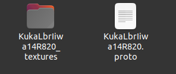
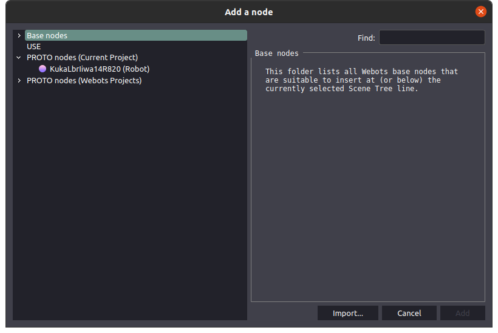
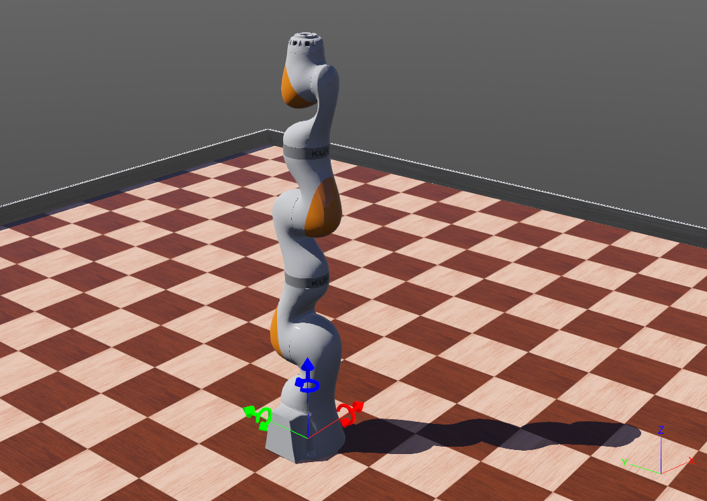

# urdf2webots Tutorial

## Prerequisites:
Make sure you have the newest version of urdf2webots installed. If you have an older version installed via pip, use this command:

```
pip install --no-cache-dir --upgrade urdf2webots
```

Alternatively, if you want to install from source, follow the instructions in the [main README](../README.md)


## Get a URDF from a GitHub repository (optional if you already have a URDF)

Example using this Kuka ROS repo:
https://github.com/ros-industrial/kuka_experimental

```
cd catkin_ws/src
git clone https://github.com/ros-industrial/kuka_experimental
cd ..
catkin_make  # or catkin build depending on what you use
source devel/setup.bash
```
**Note:** If you want to convert this exact same robot, you will have to replace the file at
`kuka_experimental/kuka_lbr_iiwa_support/meshes/lbr_iiwa_14_r820/visual/base_link.dae`
with this (original file is corrupted):
[base_link.dae](https://raw.githubusercontent.com/wiki/cyberbotics/urdf2webots/files/base_link.dae)
```
cp ~/Downloads/base_link.dae src/kuka_experimental/kuka_lbr_iiwa_support/meshes/lbr_iiwa_14_r820/visual/base_link.dae
```

To follow the below instructions, you'll need to have the `xacro` tool installed; some ROS installations don't include it by default. If you don't have it, you can install it as follows on Ubuntu (substitute your ROS distribution for "noetic"):
```
sudo apt install ros-noetic-xacro
```

Navigate to the launch folder and open the launch file that launches your robot or displays it in Rviz. For this tutorial we chose the KUKA lbr iiwa robot. The launch file is:
`/kuka_experimental/kuka_lbr_iiwa_support/launch/load_lbr_iiwa_14_r820.launch`
Opening the launch file we look for the line, uploading the robot_description parameter, here it is this line:

`<param name="robot_description" command="$(find xacro)/xacro.py '$(find kuka_lbr_iiwa_support)/urdf/lbr_iiwa_14_r820.xacro'" />`

This tells us which xacro file and with what parameters we need to generate our URDF from.
Next in your Terminal, navigate to the urdf folder specified in the launch file and enter following command:

```
cd src/kuka_experimental/kuka_lbr_iiwa_support/urdf
rosrun xacro xacro -o model.urdf lbr_iiwa_14_r820.xacro
```
This will compile the URDF from the XACRO file and save it as model.urdf in the same directory. If your launch file added parameters to the XACRO calls, you need to add them here too.

<br />
<br />

## Converting the URDF to a PROTO file

Convert the model.urdf with the following command. I recommend the added parameter:
**--box-collision**: simplifies objects. This can greatly improve the simulation of object interactions, especially grasping.

**--tool-slot=tool0** is more specific for robotic arms. Have a look at all options and explanations below. To figure out, what the **--tool-slot=LinkName** is called for your robotic arm, you will have to open the model.urdf and figure out what the link is called.

```
python -m urdf2webots.importer --input=model.urdf --box-collision --tool-slot=tool0
```

Check the [main README](../README.md) for a list of all options.

After your file has been converted, you should have something like this:



Copy these files to your project’s `protos` directory (of course you can do this step by using your OS's GUI):

```
cp -r KukaLbrIiwa14R820* ~/my_simulation/protos/
```


## Loading converted model in WEBOTS

Launch Webots and your project world. Click on the plus sign to add your model.


You should see your newly converted model under `PROTO nodes (Current Project)`.
Select it and click `Add`



It should look similar to this:




If something is not right, such as orientation, right-click on the robot in the Scene Tree and select `View PROTO Source`.
This should open the PROTO file in Webot’s text editor and should look something like this:


The fields in the header correspond to the fields (parameters) we see in the Scene Tree (compare image above and below)


For example, in order to change the default orientation of our model, we can change the `rotation` field in the PROTO file. Most URDF models use the z-axis as `up`, as Webots, by default.

If the default values are not correct, you can either parse the **--rotation="0 1 0 1.5708"** option at the start or manually adjust the values of your robot node in the scene tree (left side), until the robot is positioned correctly. Then simply copy and paste the values into the `PROTO source`. Example:
`field  SFRotation  rotation        0 0 1 0`
to
`field  SFRotation  rotation     0 1 0 1.5708`

Dont forget to save the file (<kbd>Ctrl</kbd> + <kbd>S</kbd>). In order to see the changes to your PROTO file in action, either save your world and reload it, or delete the robot and add it again.

## Converting the URDF to a Webots Robot string and import it

You can achieve the exact same result as above by converting the URDF to a Webots Robot string and use a supervisor to add this robot in the simulation.

First import the library:

```
from urdf2webots.importer import convertUrdfFile
```

Then you will need to get the node where you will insert your robot. The most suitable place is at the last position in the scene tree.
This can be obtained with:

```
root_node = robot.getRoot()
children_field = root_node.getField('children')
```

Finally you can convert your URDF file and add its corresponding robot to the simulation (be sure to set `robotName`, otherwise the tool will convert the URDF into a PROTO file):

```
robot_string = convertUrdfFile(input="model.urdf", robotName="MyRobotName")
children_field.importMFNodeFromString(-1, robot_string)
```

Note that you can also convert directly the content of your URDF file instead with:

```
import pathlib
from urdf2webots.importer import convertUrdfContent
robot_description = pathlib.Path("model.urdf").read_text()
convertUrdfContent(input=robot_description, robotName="myRobot")
```